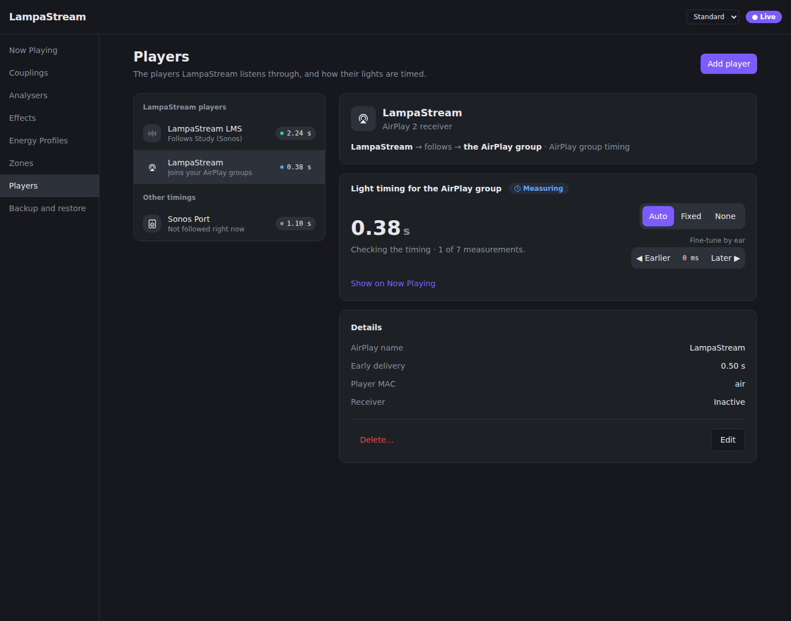
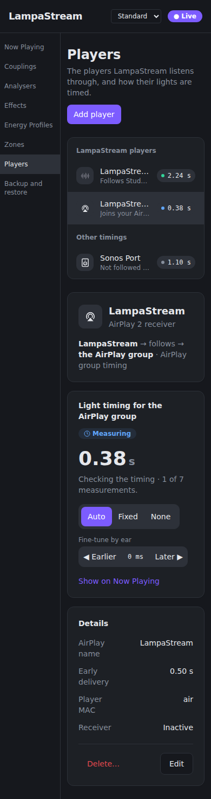

# Configuration

The web UI and API persist configuration through Storage. `LAMPASTREAM_CONFIG` defaults
to `/etc/lampastream/config.json`. Keep a backup before migration or target experiments.
The installer explicitly migrates supported historical formats before startup.
Current startup rejects non-current schema and clears stale active-coupling state;
it does not restore a previous process merely because a stored ID was active.

## Entities

- VirtualPlayer: audio ingress identity and LMS/AirPlay settings.
- Controller: output-controller credentials and endpoint.
- Zone: controller/Entertainment area selection.
- Analyser: Spectrum and onset settings shared by Couplings.
- Effect: rendering behavior/settings.
- EnergyProfile: high/low-energy Effects and blend behavior.
- Coupling: links the player, zone, Analyser and EnergyProfile.

Profile is an internal propagated runtime configuration, not a second authoritative
backend selector. Runtime builders copy Analyser settings, including
spectrum_backend. Unknown engine IDs raise explicit errors.

## Analysis defaults

| Field | Default | Meaning |
|---|---|---|
| `bars_source` | `pcm_pipeline` | Schema compatibility field; only canonical PCM is valid |
| `spectrum_backend` | `v2` | Canonical Spectrum engine; currently `v2` / `cavacore` |
| `bars` | 30 | Spectrum bar count |
| `lower_cutoff_freq` | 50 | Hz |
| `higher_cutoff_freq` | 12000 | Hz |
| `onset_method` | `combined` | Also `multiband` / `superflux` |
| `onset_delta` | 0.1 | Onset threshold margin |
| `onset_alpha` | 0.9 | Adaptive suppression decay |
| `superflux_mu` | 3 | Superflux setting |
| `superflux_lag` | 2 | Superflux lag |
| `use_hpss_separation` | false | Optional HPSS on canonical PCM (both engines) |

For embedded CAVA, set `spectrum_backend=cavacore`. Both LMS and AirPlay use
canonical PCM. The installer runs the existing offline migration before starting
the new runtime: legacy `bars_source=cava` rows become `pcm_pipeline`, with `v2`
when no backend was explicitly stored. Explicit backend choices, HPSS and all
other settings are preserved. Direct config loading rejects unmigrated CAVA rows.

Allowed engine IDs derive from the static registry. Saving/deserializing a valid
engine ID does not load native code. Activation may still fail if unavailable.
No explicit CAVA request silently falls back to V2.

## Live changes

Canonical band/cutoff/backend changes replace canonical analysis. Beat settings
rebuild the active BeatDetector safely. External FIFO changes use its process restart
path. Analyser-ID changes crossing canonical/FIFO modes require full session teardown
and activation. Rendering settings remain owned by Effects/runtime rendering.

Retirement is incomplete teardown, not successful activation. `analysis_stopping`
reports retained ownership; retry deactivation once the worker exits. See [API](api.md).
The implementation does not promise crash-atomic transactions across JSON storage,
process creation and every possible operational failure.

## Persisted schema boundary

Current schema version: `schema_version: 1`. Collections: `controllers`,
`virtual_players`, `zones`, `analysers`, `effects`, `energy_profiles`, `couplings`,
`player_latencies`, plus `active_coupling_id`. Coupling has only the current
`player_id`, `zone_id`, `analyser_id`, `energy_profile_id` references.
Normal model/storage deserialization rejects unknown keys; it does not translate
historical names. Only the explicit installer migration knows those names.
See [migration and backups](installation.md#migration).

## Backup and restore

**Full backups are sensitive.** They include Hue Bridge pairing credentials and
must not be published, logged or stored in a public location. Ordinary Controller
API responses still hide credentials; the explicit full-backup endpoint includes them.
LampaStream currently has no authentication. Restrict UI/API access to a trusted network;
use a protected connection or tunnel when transferring a backup across networks.

### Configuration inventory

Every field of every persisted entity is exported and restored, including fields
not currently exposed by a UI control. The same current model/schema validation is
used for file and HTTP operations.

| Configurable item | Persisted collection | Export / restore |
|---|---|---|
| Controller identity, type, host, app_key, client_key | `controllers` | All fields, credentials unredacted |
| LMS and AirPlay type, identity, connection, display, ALSA and follower settings | `virtual_players` | All fields |
| Lighting group, Controller and Entertainment Area references | `zones` | All fields |
| Spectrum backend, bands/cutoffs, onset and analysis settings | `analysers` | All fields |
| Visual algorithm and rendering settings | `effects` | All fields |
| High/low Effect references and blend behavior | `energy_profiles` | All fields |
| Entity bindings and enabled selection | `couplings` | All fields |
| Per-listening-player latency strategy, delay, name, manual trim and saved measurement | `player_latencies` | All fields |

Selected references must resolve. Empty references allowed by the current editable
schema remain unbound; backup does not invent missing entities. Invalid nonempty
references prevent export and import. Complete field sets are exported and required
on import, so an incomplete backup cannot silently reset settings to defaults.

Excluded: the active session selection (`active_coupling_id` is always null), playback,
audio/features/publication queues, SHM/FFT state, processes, connections, logs, caches,
binaries, venv and frontend artifacts. Runtime Profile objects are reconstructed from
entities. Generated CAVA/receiver files are recreated at activation. OS environment,
network/device mappings, custom systemd overrides and manually edited receiver settings
are deployment administration, not portable LampaStream configuration. The installer owns
the standard deployment defaults. There is no additional persisted browser setting store.

### Format and validation

JSON envelope: `format="lampastream-config-backup"`, `backup_version=1`,
`schema_version=1`, UTC `created_at`, `lampastream_version`, `lampastream_commit`,
`contains_secrets=true`, and `configuration` (current persisted schema).
Backup format version and configuration schema version are distinct and both checked.
Unsupported versions, unknown fields/collections, partial entities, duplicate JSON keys,
malformed types and dangling references are rejected. Upload/file input is limited to
4 MiB. Historical schema aliases are not accepted; future version conversion must be
explicit. Installed builds include the deployed commit; source-only development may
report `unknown`.

### UI / API

Open **Backup and restore**. Export downloads a sensitive JSON file. For restore,
deactivate the Coupling first, select a backup file, check the replacement confirmation,
then click **Restore configuration**. Selecting a file alone never uploads it.

- `GET /api/config/export`: JSON attachment, timestamp filename, `Cache-Control: no-store`.
- `POST /api/config/import`: JSON body (`Content-Type: application/json`), not multipart.
  Returns restored/inactive status with `restart_required=false`. Errors have a fixed
  `detail.code` and safe `detail.message`; uploaded configuration is never echoed.
- Invalid backup: 422; oversized input: 413; wrong media type: 415; active/retiring
  runtime or failed commit: 409. Backup responses use `Cache-Control: no-store`.

### Runtime and failure policy

Restore requires a fully inactive PlayerManager, including completion of retiring-worker
teardown. An active/retiring session is rejected **before mutation** and remains owned;
restore does not attempt a potentially destructive stop/restart rollback. API configuration
writes are serialized so a request begun before restore cannot write stale settings after it.
Storage readers see the old complete file or the new complete file, never part of each.

Before replacement, restore writes an exact-byte safety copy:

```text
/etc/lampastream/config.json.pre-restore.<SHA256-of-original>.<unique>.bak
```

It validates and prepares the new file before atomic rename. Validation, safety-backup,
preparation or rename failure leaves the original configuration intact; safety backups
are retained. After commit there is no runtime reload step that can fail: no session is
active, and Storage reads the new file directly. Activation of a restored Coupling is
an explicit subsequent operation. This is atomic file visibility, not a transaction
against power failure or external lighting hardware.

### CLI / disaster recovery

All CLI and API operations use `lampastream.backup`, not separate serializers.

```sh
# Export may run while LampaStream is running. Existing output files are never overwritten.
sudo /opt/lampastream/.venv/bin/python -m lampastream.backup export /secure/lampastream-backup.json

# Validation only: no configuration, lock or runtime mutation.
sudo /opt/lampastream/.venv/bin/python -m lampastream.backup import --check /secure/lampastream-backup.json

# Offline restore: stop service first; the runtime ownership lease enforces this.
sudo systemctl stop lampastream
sudo /opt/lampastream/.venv/bin/python -m lampastream.backup import /secure/lampastream-backup.json
sudo systemctl start lampastream
```

For a custom file, place `--config /path/config.json` before `export` or `import`.
New CLI export and restore-safety files are mode 0600, owned by the invoking user.
Every restore creates a distinct safety copy, so root CLI and service-account API
operations never need to read or overwrite each other's private backup files.
The restored config retains its owner/group and is mode 0600. Browsers control download
file permissions; protect downloads yourself. CLI success/error text never prints
credential values. A fixed adjacent `.runtime.lock` file is intentionally retained;
do not delete it while runtime/restore is running.

Do not run the installer/migration or edit configuration files concurrently with
CLI restore; those external administration tools are not API transactions.
Offline restore can also replace a corrupt existing configuration file: the original
bytes are still saved first, while the incoming backup must pass full validation.
Repeated import is safe; it does not duplicate entities or activate playback. A new
installation needs the repository installer first, then this import. Hue pairing data
survives, provided the same Bridge remains reachable and its credentials have not been
revoked. Live lighting, LMS/AirPlay connectivity and cross-host recovery remain
**REQUIRES LXC RUNTIME VALIDATION**.

Migration backups (`pre-v1...bak`) and restore-safety backups are raw rollback files.
Portable `lampastream-config-backup` JSON is the user-created transfer/disaster-recovery
format. They are not interchangeable, and the installer does not automatically export
secret portable backups.

## Effect selection and UI scope

See the [effects catalog](effects.md) for every current `effect_type` and the settings
each renderer actually uses. Controller creation/pairing and Spectrum backend
selection currently use the API; the UI lists existing Controllers for Zones and
edits bars-source/onset settings but does not expose `spectrum_backend`.

### Gradient (`gradient`)

Gradient follows spectral centroid through a curated three-stop RGB palette,
interpolating at positions 0, 0.5 and 1. Choose **Sunset** (default), **Ocean**,
**Neon**, or **Monochrome** (a blue-white family, not greyscale) in the standard
Effect editor. `gradient_palette` defaults to `"sunset"` for older Effects;
no migration is required. Brightness uses the same overall/harmonic energy,
sensitivity and brightness floor as Solid, with per-channel clipping at 1.
The preview uses its illustrative energy input as the palette position; live
rendering uses centroid. See the historical
[LedFx colour analysis](archive/LampaStream_colour_v2_ledfx_lessons.md#root-cause-2-three-bands--rgb-is-not-how-this-is-done)
for the motivation. This effect does not change audio analysis or energy sources.

### Band Colours (`band_colours`, `band_colours_spatial`)

Choose 3–8 colours, one per equal logarithmic frequency band. **Band Colours**
adds their energy-weighted RGB channels into a uniform scene; **Band Colours
(Spatial)** places the bands from left to right, cross-fading between neighbours.
Sensitivity scales band energies; channels clip at 1 and onset flash lifts them
towards white. These renderers have no brightness floor.

The Standard editor offers band count, native colour swatches and the approved
preset table. **Distribute evenly** spaces hues at S=90%, L=55%; changing band
count also redistributes the entire list. The default colours are `#F42525`,
`#25F425`, `#2525F4`. Frequency labels use the active coupling's analyser when its
EnergyProfile references the edited Effect. Otherwise they explicitly show a
50–12000 Hz default-range preview. These labels do not persist per-effect cutoffs.

Expert **Colour Table & Playback** reorders colours without changing band ranges.
`band_playback` defaults to `static`. `loop` rotates the table; `shuffle` draws
non-zero rotation amounts from a shuffled queue of 1…N−1, applied to the current
colours, with no repeated amount across cycle boundaries; `random` creates
fresh hues at S=85%, L=55%; `mix` independently samples the original table for each
band, allowing duplicates. `band_advance=beat` advances on onset rising edges only.
`timer` advances once when `band_advance_interval_s` has elapsed (default 2 seconds,
finite and positive). Playback state belongs to each renderer instance. Duplicate
colour entries remain permitted. No new audio analysis or schema migration is needed.

## Referenced entities and deletion

Deleting a VirtualPlayer, Zone, Analyser or EnergyProfile referenced by a Coupling
returns HTTP 409. Controllers referenced by Zones and Effects referenced by either
EnergyProfile effect slot are protected too. The error identifies the blocking
entities; reassign or remove their references first. Deletion never cascades.
The UI displays the error in its confirmation dialog. API creates/patches also
reject nonexistent reference targets; an empty selection remains permitted.

### Repairing a previously dangling player reference

Use the **current checkout's** migration tool, including when an older installation
cannot finish migration. First identify the Coupling; inspection is read-only and
prints only its name, IDs, available player names/types, and a SHA256 fingerprint:

```sh
sudo env PYTHONPATH="$PWD/src" /opt/lampastream/.venv/bin/python -m lampastream.migration \
  /etc/lampastream/config.json --inspect-coupling COUPLING_ID
```

Do not choose an action until that report identifies the intended binding. Stop
LampaStream before applying a repair. With the fingerprint from inspection, choose
**one** explicit operation:

```sh
sudo systemctl stop lampastream
# Remove only the identified Coupling whose player is missing:
sudo env PYTHONPATH="$PWD/src" /opt/lampastream/.venv/bin/python -m lampastream.migration \
  /etc/lampastream/config.json --remove-dangling-coupling COUPLING_ID --expect-sha256 SHA256
# OR reassign that Coupling to an explicitly selected existing player:
sudo env PYTHONPATH="$PWD/src" /opt/lampastream/.venv/bin/python -m lampastream.migration \
  /etc/lampastream/config.json --reassign-dangling-coupling COUPLING_ID \
  --player-id EXISTING_PLAYER_ID --expect-sha256 SHA256
```

The command rejects changed fingerprints, non-dangling bindings and invalid target
players. It validates the complete repaired configuration before creating an exact
0600 `config.json.pre-v1.<sha256>.bak` safety copy and atomically replacing the file.
For historical data, the explicitly superseded Profile snapshot is removed with
that binding so it cannot resurrect it. All original bytes remain in the backup.
An active repaired binding is deactivated; there is no automatic activation.
The runtime lease prevents repair while the current LampaStream process owns the file.
After success, resume `sudo ./scripts/install-lampastream.sh`, then select/activate the
intended Coupling. Never edit the JSON manually to bypass validation.


## LMS follow mode

VirtualPlayers have a `follow_mode` setting:

- `manual` (default, including existing configurations): retains the existing
  fixed `follow_player_mac` and its event-driven track mirroring behaviour.
- `sync_group`: manually sync LampaStream with a room in LMS first. Native LMS sync
  delivers the audio. LampaStream passively observes `listen 1` and queries its own
  player's `sync ?` on activation/reconnection, on sync/client notifications,
  and every five seconds. It never sends playback commands or changes group
  membership in this mode.

The Players editor exposes both modes and retains the manual MAC when
switching to automatic mode. Changing modes deactivates an active owning session;
activate the Coupling again to use the new setting.

Auto mode excludes all LampaStream-managed player identities. With multiple external
group members it keeps the selected peer while that peer remains present;
otherwise it selects the first normalised MAC in sorted order. The displayed
target and latency configuration follow that selection. Different rooms can
have different latency settings even though they share a queue; use manual mode
when a specific room must be pinned.

Now Playing shows a warning when LampaStream is not synced, when only managed players
are grouped, or when LMS cannot be queried. No target is inferred from which
independent player happens to be playing. A query failure clears the detected
target until a successful refresh. Automatic selection is runtime state, not a
replacement for the saved manual MAC.

Local tests cover selection, notifications, polling, reconnect, teardown, and
absence of playback/group mutations. Live LMS/plugin and audio delivery behavior
still requires target-LXC verification.

### Energy Profile source selection

`energy_source` defaults to `sustained` in the API and stored-profile model, preserving
existing profiles. Newly created profiles in the UI use `peak_envelope` with Auto.
The Standard editor hides energy-source settings entirely; select Expert in the
header or profile editor to configure them. This browser preference persists across
Energy Profiles and Now Playing through local storage (or for the current session
when storage is blocked). Existing profiles retain their selected input and blend
response. The `sustained` source with a PCM tap uses SustainedEnergyTracker; **canonical sessions
currently publish `sustained_energy=None` and therefore use raw `full`**. A low
canonical blend on steady music is not evidence that the dual-timescale tracker
decayed: that tracker is not its input. Optional colour band normalisation does
not change this fallback or any raw-derived aggregate.

Now Playing labels the profile **Energy Trigger**, with **Open trigger** linking
to its editor. Low- and High-energy Effect links are always visible in Standard
and Expert modes; Off dims the Low-energy link without hiding it.

- `off`: immediately supplies a constant energy input of 1 without reading audio
  features. Existing blend smoothing settles at 100% High-energy Effect. There
  are no source parameters; audio analysis needed by the Effects continues normally.
- `loudness_fixed`: map momentary LUFS linearly between `lufs_floor=-30` and
  `lufs_ceiling=-8`, clamped to 0..1. At −11 LUFS the input is about 86%, even
  on a constant-level track. Bounds must be finite and strictly ordered.
- `loudness_adaptive`: start with a −30..−8 LUFS window. Its floor/ceiling expand
  outward with a 1-second time constant and recover inward using
  `adaptation_tau_s=60` (finite and positive). The window is at least 6 LU wide.
  Constant material gradually becomes ordinary again; use fixed mode to retain
  an absolute level reference. The fixed-mode bounds do not configure adaptation.

Silence/non-finite or unavailable loudness yields zero and does not train the
adaptive window. External FIFO currently has no canonical loudness meter, so its
loudness modes receive zero. Switching source or editing settings applies live;
the mixer is rebuilt and the adaptive window starts afresh. Existing blend
thresholds, cubic smoothstep and Response smoothing follow source selection
unchanged. The editor's marker uses the actual selected input and shows LUFS
alongside it in loudness modes. Save changes to compare their live effect.

These behaviours are code/test-verified; musical A/B judgement remains a live
deployment check.


### Peak envelope (`peak_envelope`)

With reshape disabled (the default), peak envelope uses unweighted, phase-safe
stereo RMS (`AudioFeatures.level`) with exactly the previous behavior. It follows
rising input quickly and falling input slowly, then divides the input by that envelope and clamps
the result to 0..1. The RMS window is 2048 canonical samples (about 42.7 ms at
48 kHz), published on the existing shared-hop clock by the loudness processor.
Missing or non-finite RMS produces zero without updating the envelope; measured
silence produces zero and allows the envelope to release. External CAVA/FIFO has
no canonical PCM RMS, so this mode receives zero there; select a PCM analyser.

This option addresses the reported lack of useful energy variation on heavily
mastered tracks when using [LUFS-based source selection](#energy-profile-source-selection).
It preserves short-term amplitude dips independently of the LUFS window. It does
not promise variation from a perfectly constant input: an envelope initialized at
that input gives a ratio of 1.0. Rising transients can also reach the clamp while
the finite attack catches up. The current `loudness_adaptive` implementation has
a six-LU minimum span and converges near 0.5 on a strictly constant LUFS input;
this change leaves that implementation intact.

Peak envelope has two independently configured stages: optional **Reshape**, then
AGC. Expert mode exposes a separate **Reshape** toggle for this source only.
`peak_reshape_enabled` defaults to `false`; enabling it replaces the RMS input
with `mean(max(0, bar) ** peak_reshape_power)` over the current spectrum bars.
`peak_reshape_power` defaults to **0.4** and must be finite and in **(0, 1]** when
enabled. Higher powers produce lower values for bars between zero and one;
exponents below one lift those bars relative to their original values. This is a
bar-to-scalar transform, not a change to the spectrum or other energy sources.
Empty bars produce zero; negative bars are clamped to zero. Non-finite bars
produce zero without training the envelope. A constant scalar still converges to
an AGC ratio of 1. Reshape works in both Auto and Manual and never disables AGC.

Disabled reshape ignores its unused power, following Auto's treatment of unused
manual time constants. Enabled reshape and Manual AGC validate independently.
Persisted JSON still requires correctly typed, finite numeric values, as it does
for the existing settings. Both stages remain hidden in Standard mode.

In Expert mode, **Auto** uses preset attack/release time constants of **0.05 s**
and **2.0 s**, regardless of stored manual values. The envelope self-calibrates
its amplitude reference; Auto does not dynamically tune the time constants.
Switching to **Manual** reveals **Attack (s)** and **Release (s)**. Attack controls
how quickly the reference rises after a louder input. Release controls how slowly
it decays after a quieter input. Both must be finite and positive, and Attack
must be strictly shorter than Release. Switching back to Auto keeps the stored
manual values but stops using them. Source/settings changes reset the mixer and
envelope. Blend thresholds and Response still apply after source selection.

Reference systems checked for this design: [LedFx's melbank filtering](https://docs.ledfx.app/en/latest/developer/melbanks.html)
uses attack/decay filtering for reactive signals; [Logic Pro's Compressor controls](https://support.apple.com/en-nz/guide/logicpro/lgcef1bec9f3/10.7/mac/11.0)
retain Attack and Release terminology. LampaStream uses the same DSP terms in
Expert mode while keeping source configuration out of Standard mode.

## Automatic followed-player latency

The Players page offers **None**, **Fixed** and **Auto**, independently for each
listening player's MAC. Auto works in **Manual — fixed player** follow mode using
standard LMS CLI positions, without UPnP or player-specific protocols. It requires
both players to be playing the same mirrored URL. The page labels this target
**Followed player**; sync-group mode retains **Sync master detected**.

Auto reads `<mac> time ?` for both players back to back, compensates for their
query midpoints with a monotonic clock, and alternates the query order. It adds no
status polling. Existing event-driven follower URL lookups and the track display's
status subscription retain their separate roles; repeated full status polling of
the followed player remains forbidden.

A five-second guard follows newsong, seek, pause, resume and reconnect events on
either player. A thirty-second burst starts after the guard, sampling every three
seconds; subsequent samples are fifteen seconds apart. Paused, stopped, disconnected
or mismatched tracks produce no measurement requests. The estimator retains seven
valid samples, rejects values more than 400 ms from its current median (including
whole-second position corrections), and reports precision as 1.4826 times the
median absolute deviation. Precision describes position consistency, not a
measurement of acoustic latency.

The followed player's `playerpref playDelay ?` preference is read once when the
activation first becomes eligible. An absent preference contributes zero. LMS's
Player → Synchronisation **Player Delay** is expressed in milliseconds: positive
values compensate for a player's delayed output. The applied delay is:

```
max(0, median residual ms + Player Delay ms + trim ms)
```

Manual trim ranges from −1000 to +1000 ms. The first estimate after a newsong or
re-alignment steps directly once three samples agree within 200 ms; subsequent
updates change by at most 50 ms. Editing trim preserves the estimator and applies
the new target through that same limit. A median below −300 ms after the burst triggers
one own-player position re-alignment per followed track and a fresh burst. This
once-per-track guard survives latency-entry edits; explicit followed-player seeks
still mirror to the own player independently. The
followed player is never sought by this mechanism; non-seekable streams may remain
uncompensated when the own player runs behind.

Stable `measured_delay_ms` and `measured_at` (Unix seconds) are saved per MAC. The
saved measurement includes Player Delay but excludes trim; it supplies the starting
value on the next activation. Configuration writes do not accept these read-only
fields. `GET /api/player-latencies` includes a read-only `status` with effective
strategy, applied delay, median residual, Player Delay, trim, sample count,
precision, last accepted sample time and state. Auto status refreshes every two
seconds in the UI. States are `idle`, `measuring`, `stable` and
`not measurable (sync group)`; the latter includes the fallback reason.

Sync-group members share LMS's reported position, so Auto falls back to
`fixed_delay_ms` without position or preference measurement queries. Manual trim
is not added to that explicitly configured Fixed fallback.

This delay queues rendered scenes at the existing Hue output boundary, with
approximately 33 ms frame quantisation. Analysis publication, Hue transport and
physical lamp response retain their intrinsic latency; Auto does not measure or
subtract those delays. Use trim to adjust the audible/visible result. DSP and PCM
processing remain unchanged.

The existing explicit, backed-up schema-1 migration normalises old latency entries:
`upnp` becomes `fixed`, retaining `fixed_delay_ms`, and the unused `speaker_ip`
placeholder is removed. New fields default to zero/null. Existing None and Fixed
configurations remain valid. Run the installer migration before opening an older
configuration containing reserved fields. The LMS editor no longer exposes an
ALSA device; older API/configuration values remain accepted for compatibility and
are ignored by yeney-player.

Preference verification: LMS source at
[`f0a77cd`](https://github.com/LMS-Community/slimserver/tree/f0a77cdce73ef1d1cc53019967d845dfcd0f8fb1),
[`Synchronization.pm`](https://github.com/LMS-Community/slimserver/blob/f0a77cdce73ef1d1cc53019967d845dfcd0f8fb1/Slim/Web/Settings/Player/Synchronization.pm#L39)
selects `playDelay`;
[`StreamingController.pm`](https://github.com/LMS-Community/slimserver/blob/f0a77cdce73ef1d1cc53019967d845dfcd0f8fb1/Slim/Player/StreamingController.pm#L1509)
subtracts positive delay from the player's scheduled start time and adds it to
synchronisation play points. `Queries.pm` defaults player preferences to the
`server` namespace.

## Light timing on Now Playing

The Light timing card sits directly below the track. It names the followed player
and moves the old Sync master and Delay information out of Live preview's Status
list. Player settings opens Players with the relevant player selected. The disclosure remembers its open
or folded choice in this browser; folded, it still shows the state and applied
light delay. Details starts closed and explains the measured difference, LMS
Player Delay, fine-tune and applied delay.

In sync shows the applied seconds, measurement precision, sample count, last
sample time and recent measurement chart. Measuring shows progress out of seven
while retaining the last good delay. Fixed offers Measure automatically; Can't
measure explains the sync-group fallback and Manual — fixed player follow mode.
Paused or idle retains the last measured delay until playback resumes. Not set up
creates an Auto entry for the followed player; No delay switches an existing None
entry to Auto. Every state includes a readable label and icon as well as colour.

For automatically measured timing, Fine-tune by ear saves `trim_ms` in 10 ms steps between −1000 and +1000 ms.
Earlier reduces the trim; Later increases it. The signed trim updates immediately
and successful writes show a short confirmation. The applied delay still follows
the existing estimator's 50 ms step limit. Fixed, None and sync-group fallback states retain their
existing delay behaviour and offer no fine-tune stepper. Switch to automatic
measurement to fine-tune by ear.

Timing snapshots reuse the preview websocket and refresh no faster than every
2 seconds. The read-only latency status includes `samples`: up to seven accepted
measurements, each with `residual_ms` and its Unix `timestamp`. The chart shows
the median and ±precision band. Samples are runtime data, never saved configuration,
and API create/patch requests reject samples and status fields. Reduced motion
stops the path animation and disclosure transition.

### AirPlay automatic light timing

AirPlay virtual players can use Auto in Players. The receiver uses its own
defaults with no imposed early-delivery offset. Auto reports measured processing
lag honestly: “Lights are about P ms behind the sound”. Earlier cannot advance
lights before audio arrives. A stalled active sender with a negative offset
triggers a one-shot safety rollback and a visible message. Upgrades remove only
the exact unsafe legacy timing values; different operator values are preserved.
No headroom action is offered because the pinned receiver has no reliable
normal-playback lead-time source. See [AirPlay timing](airplay-timing.md) for the
incident, source evidence, corrected policy and read-only diagnostic probe.
Fine-tune accounts for physical lamp response, which is not measured by a sensor.

## Players

Players combines player identity, connection details and light timing in a list–detail view.
LampaStream players lists every LMS yeney-player and AirPlay receiver. Other timings
lists saved timings whose listening-player MAC is not currently followed by a virtual
player (AirPlay uses the receiver MAC). Active LMS sync-group targets come from the
preview status; inactive groups have no observable current target. Timings are retained
when deleting a virtual player and appear under Other timings. Deleting a saved timing
removes only that entry. Both actions ask for confirmation in the page.

Select a row with the mouse or Up/Down keys; this browser remembers the selection.
Auto, Fixed and None change the existing timing entry. Auto offers Earlier/Later in
10 ms steps, limited to ±1000 ms; Measure automatically creates an entry if needed.
Add player and Edit use the existing player editor. Saved timings use the timing editor.
The list stacks above the details on phones. Configuration refreshes every two seconds;
active timing and engine/receiver status reuse the preview websocket.

`/players?player=<virtual-player-id-or-listening-player-MAC>` selects a player.
Old `/virtual-players`, `/latency`, `#players`, `#virtual-players` and `#latency`
bookmarks open Players; legacy page names redirect to `/players`, retaining a `player`
query parameter. Show on Now Playing opens the current active session; selecting a
player in settings does not change the active coupling or start playback.




